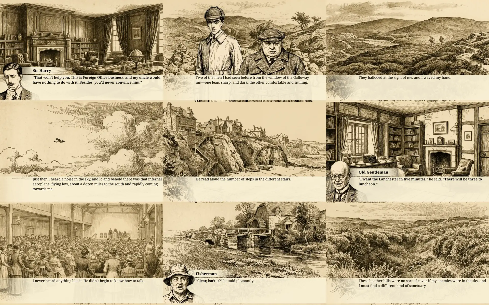

### *The Thirty-Nine Steps*: The Visual Novel

This repository contains the metadata and images for the visual novel transformation (pulpification) of John Buchan's book *The Thirty-Nine Steps*.

You can read it in a few ways:

* Online at https://publicdomainpulp.com/vn/TheThirtyNineSteps
* Locally at http://localhost:1929/vn/TheThirtyNineSteps running https://github.com/JohnQPulp/PublicDomainPulp (ASP.NET/C#) from source
* Locally via static html file using the tool https://github.com/JohnQPulp/Pulpifier (C#) from source

### License Information

*The Thirty-Nine Steps* by John Buchan is in the public domain in the United States.

All original contributions in this repository — including all metadata-edited text derived from the public-domain source, all images, and all generated HTML or other output produced from these materials — are released under the Creative Commons CC0 1.0 Universal dedication.

To the extent possible under law, the contributors have waived all copyright and related or neighboring rights to their contributions. You may copy, modify, distribute, and perform the work, even for commercial purposes, all without asking permission.

CC0 1.0 Universal: https://creativecommons.org/publicdomain/zero/1.0/
